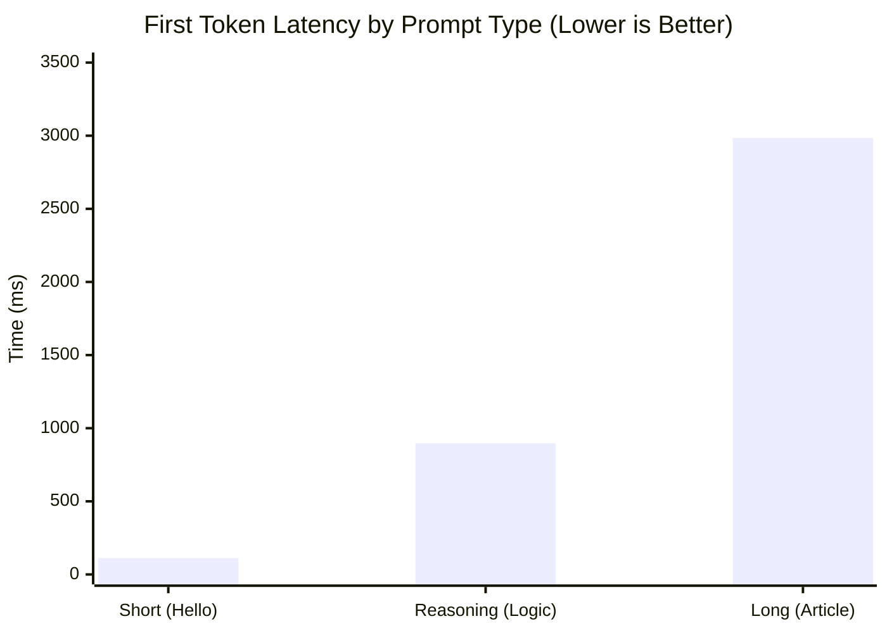
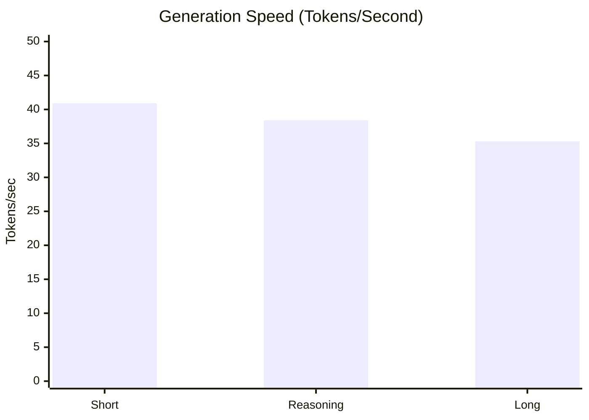
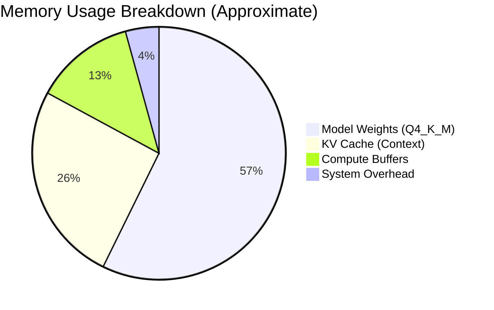

# Phase 1: Baseline Performance Results

> **Date**: February 12, 2026
> **Model**: TinyLlama 1.1B Chat (Q4_K_M)
> **Hardware**: Intel Core Ultra 9 275HX (24 Cores, 64GB RAM)

This document summarizes the initial performance baseline of our C++ inference engine (`ll_llm.exe`).

---

## 1. Summary Metrics

We tested three prompt scenarios to measure different aspects of the engine:

| Metric | Short Prompt <br>(Latency Test) | Long Prompt <br>(Prefill Test) | Reasoning <br>(Mixed Workload) |
| :--- | :--- | :--- | :--- |
| **First Token Latency** | **112.16 ms** | **2,983.71 ms** | **896.90 ms** |
| **Generation Speed** | **40.91 tok/s** | **35.31 tok/s** | **38.39 tok/s** |
| **Peak RAM** | 1,118 MB | 1,168 MB | 1,146 MB |
| **Model Load Time** | 722 ms | 436 ms | 574 ms |

### Key Findings

1. **Short Prompt Latency (112 ms)**: Slightly misses our <100ms target. This purely measures overhead + single token generation.
2. **Prefill Bottleneck (3.0s)**: Processing a long context (~500 tokens) takes 3 seconds. This is the **Batch Decode** phase, which is compute-bound.
3. **Consistent Throughput**: Once generation starts, we consistently hit ~35-40 tokens/second, which is faster than reading speed.

---

## 2. Latency Analysis

The "First Token Latency" is the time from hitting `Enter` to seeing the first word. It consists of two parts: **Prefill** (reading input) + **Generate** (producing Output[0]).



> [!NOTE]
> The **Long Prompt** latency is dominated by the **Prefill** phase. The engine must process all 500+ input tokens before it can generate the first output token. This is $O(N^2)$ complexity in attention, making it a critical optimization target.

---

## 3. Throughput Analysis

How fast does the model write?



Throughput drops slightly with longer context because the KV cache gets larger, making the attention mechanism slower ($O(N)$ for each new token).

---

## 4. Memory Footprint

RAM usage is dominated by the **Model Weights** + **KV Cache**.



- **TinyLlama 1.1B** is extremely lightweight (~1.1 GB total).
- For **Mistral 7B**, expect this to jump to **~4.5 GB**.

---

## 5. Next Steps for Optimization

Based on these numbers, here is our attack plan for Phase 2 & 3:

```mermaid
flowchart LR
    subgraph Bottlenecks
        A[High Prefill Latency<br/>(3,000 ms)]
        B[First Token Latency<br/>(112 ms)]
    end

    subgraph Solutions
        C[SIMD Optimization<br/>(AVX2 tuning)]
        D[Threading Strategy<br/>(Pinning)]
        E[KV Cache<br/>Memory Pooling]
    end

    A --> C
    A --> D
    B --> C
    B --> E

    style A fill:#e94560,stroke:#fff,color:#fff
    style B fill:#e94560,stroke:#fff,color:#fff
    style C fill:#533483,stroke:#fff,color:#fff
    style D fill:#533483,stroke:#fff,color:#fff
    style E fill:#533483,stroke:#fff,color:#fff
```

1. **Reduce Prefill Time**: The 3s delay on long prompts is the biggest user experience killer. We need to optimize the batch processing loop.
2. **Shave 12ms off First Token**: To hit <100ms on short prompts, we likely need to optimize thread startup or memory allocation overhead.
