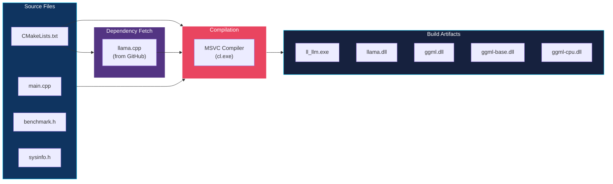
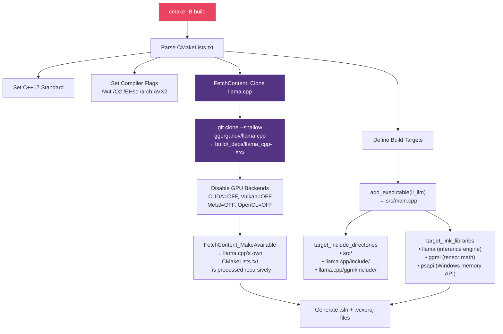
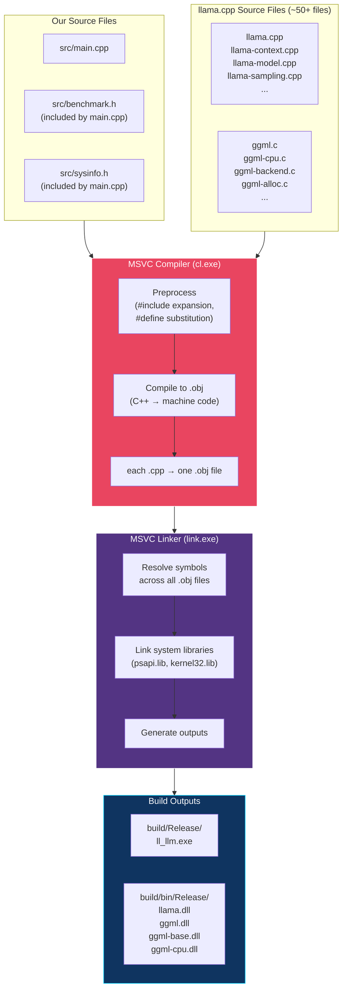
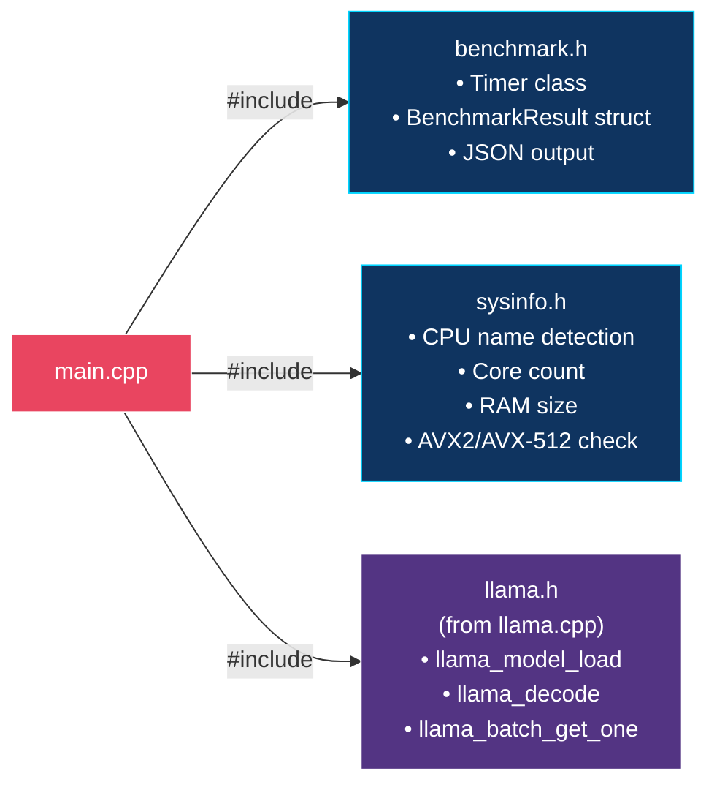
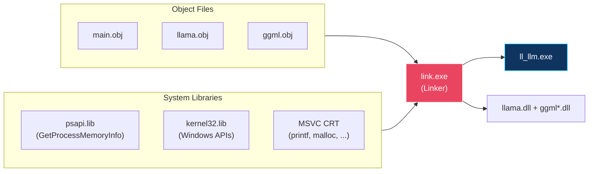
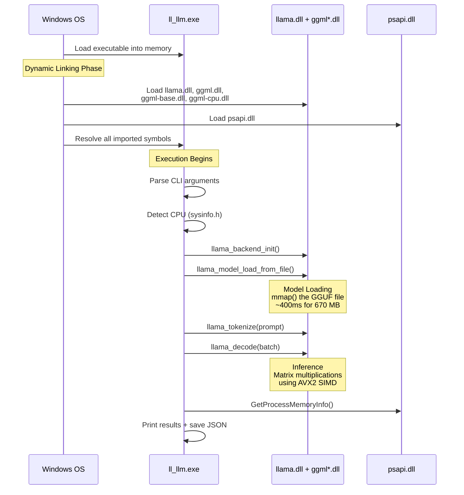

# Compilation Process — How `ll_llm.exe` Is Built

> This document explains every step of the build process, from source code to executable.

---

## Overview

The project uses **CMake** as its build system and **MSVC** (Visual Studio Build Tools) as the compiler. The key complexity is that the main dependency — **llama.cpp** — is fetched and compiled from source as part of our build.



---

## Step 1: CMake Configure

```bash
cmake -B build -DCMAKE_BUILD_TYPE=Release
```

This step reads `CMakeLists.txt` and generates the Visual Studio build files (`.sln`, `.vcxproj`). Here's what happens:



### What FetchContent Does

`FetchContent` is CMake's built-in dependency manager. On first configuration it:

1. Clones `llama.cpp` from GitHub into `build/_deps/llama_cpp-src/`
2. Processes llama.cpp's own `CMakeLists.txt` as if it were part of our project
3. Makes all llama.cpp targets (`llama`, `ggml`, `ggml-base`, `ggml-cpu`) available for linking

On subsequent builds, the clone is cached — it won't re-download unless you delete the `build/` directory.

### Compiler Flags Explained

| Flag | Purpose |
| ---- | ------- |
| `/W4` | Warning level 4 — catch most potential bugs at compile time |
| `/O2` | Full optimization — enables inlining, loop unrolling, SIMD auto-vectorization |
| `/EHsc` | C++ exception handling — required for `try`/`catch` |
| `/arch:AVX2` | Enable AVX2 SIMD instructions — process 8 floats per instruction |

---

## Step 2: Compilation

```bash
cmake --build build --config Release
```

This step compiles every `.cpp` file into object files (`.obj`), then links them into executables and DLLs.



### What Gets Compiled

| Component | Source Files | Output | Role |
| --------- | ----------- | ------ | ---- |
| **ll_llm** | `main.cpp` (includes `benchmark.h`, `sysinfo.h`) | `ll_llm.exe` | Our benchmark harness |
| **llama** | `llama.cpp`, `llama-context.cpp`, `llama-model.cpp`, ... | `llama.dll` | Model loading, tokenization, inference |
| **ggml** | `ggml.c`, `ggml-alloc.c`, `ggml-backend.c`, ... | `ggml.dll` | Core tensor operations |
| **ggml-base** | Backend base abstractions | `ggml-base.dll` | Backend management |
| **ggml-cpu** | `ggml-cpu.c` (AVX2/SSE kernels) | `ggml-cpu.dll` | CPU-optimized SIMD matrix math |

### Preprocessing: How Headers Work

`main.cpp` is the only `.cpp` file we write, but it `#include`s two headers:



The preprocessor pastes the contents of each header directly into `main.cpp` before compilation. The result is one large "translation unit" that the compiler converts to `main.obj`.

---

## Step 3: Linking

The linker combines all compiled object files and resolves cross-references:



### Why DLLs?

llama.cpp builds as **shared libraries** (DLLs) by default. This means:

- `ll_llm.exe` contains only our code (~40 KB)
- `llama.dll` + `ggml*.dll` contain the heavy inference engine (~15 MB total)
- At runtime, Windows loads the DLLs into the same process

> [!IMPORTANT]
> The DLLs are built to `build/bin/Release/` while the exe goes to `build/Release/`. You must copy the DLLs next to the exe for it to run. Without them, the exe silently exits with code 1.

---

## Step 4: Runtime — What Happens When You Run `ll_llm.exe`



---

## Complete Build Command Sequence

```bash
# 1. Configure (first time only — downloads llama.cpp)
cmake -B build -DCMAKE_BUILD_TYPE=Release

# 2. Compile + Link
cmake --build build --config Release

# 3. Copy DLLs (required after clean build)
cp build/bin/Release/*.dll build/Release/

# 4. Run
./build/Release/ll_llm.exe --model models/your_model.gguf --threads 4
```

---

## Directory Layout After Build

```text
LL_LLM/
├── CMakeLists.txt                          ← Build configuration
├── src/
│   ├── main.cpp                            ← Our code (entry point)
│   ├── benchmark.h                         ← Timer + metrics
│   └── sysinfo.h                           ← Hardware detection
├── build/
│   ├── Release/
│   │   ├── ll_llm.exe                      ← Our executable
│   │   ├── llama.dll                       ← (copied from bin/)
│   │   ├── ggml.dll                        ← (copied from bin/)
│   │   ├── ggml-base.dll                   ← (copied from bin/)
│   │   └── ggml-cpu.dll                    ← (copied from bin/)
│   ├── bin/Release/
│   │   ├── llama.dll                       ← Original DLL location
│   │   ├── ggml.dll
│   │   ├── ggml-base.dll
│   │   └── ggml-cpu.dll
│   └── _deps/
│       └── llama_cpp-src/                  ← Fetched llama.cpp source
│           ├── include/llama.h
│           ├── ggml/include/ggml.h
│           └── src/...                     ← ~50+ source files
└── models/
    └── tinyllama-1.1b-chat-v1.0.Q4_K_M.gguf
```
