# LL_LLM — Project Documentation

> **C++ LLM Inference Optimization: A Systems Engineering Study**
>
> A deep-dive into making Large Language Models run faster on CPU-only hardware through profiling-driven optimization of quantization, memory, threading, and compute.

---

## Table of Contents

1. [Project Overview](#project-overview)
2. [How LLM Inference Works](#how-llm-inference-works)
3. [Project Architecture](#project-architecture)
4. [Phase 0 — Objective & Metrics](#phase-0--objective--metrics)
5. [Phase 1 — Baseline System](#phase-1--baseline-system)
6. [Phase 2 — Profiling & Bottleneck Analysis](#phase-2--profiling--bottleneck-analysis)
7. [Phase 3 — Quantization Study](#phase-3--quantization-study)
8. [Phase 4 — Advanced Optimizations](#phase-4--advanced-optimizations)
9. [Phase 5 — Evaluation Framework](#phase-5--evaluation-framework)
10. [Phase 6 — Portfolio Features](#phase-6--portfolio-features)
11. [Timeline & Milestones](#timeline--milestones)

---

## Project Overview

### What Is This Project?

This project is a **systematic, profiling-driven study** of LLM inference optimization in pure C++. Rather than blindly applying tricks, every optimization is backed by **measurement data**.

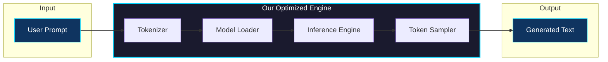
```mermaid
flowchart LR
    subgraph Input
        A[User Prompt]
    end
    subgraph Engine["Our Optimized Engine"]
        B[Tokenizer]
        C[Model Loader]
        D[Inference Engine]
        E[Token Sampler]
    end
    subgraph Output
        F[Generated Text]
    end

    A --> B --> C --> D --> E --> F

    style Engine fill:#1a1a2e,stroke:#00d4ff,stroke-width:2px,color:#fff
    style A fill:#0f3460,stroke:#00d4ff,color:#fff
    style F fill:#0f3460,stroke:#00d4ff,color:#fff
```

### Project Roadmap — All Phases

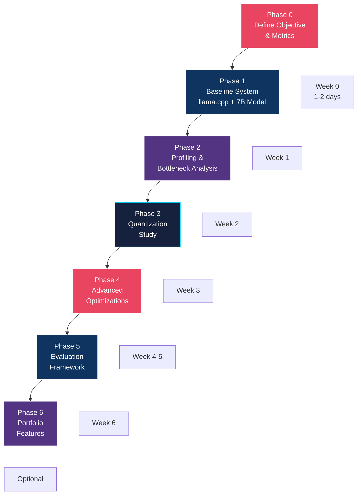
```mermaid
flowchart TB
    P0["Phase 0\nDefine Objective\n& Metrics"]
    P1["Phase 1\nBaseline System\nllama.cpp + 7B Model"]
    P2["Phase 2\nProfiling &\nBottleneck Analysis"]
    P3["Phase 3\nQuantization\nStudy"]
    P4["Phase 4\nAdvanced\nOptimizations"]
    P5["Phase 5\nEvaluation\nFramework"]
    P6["Phase 6\nPortfolio\nFeatures"]

    P0 --> P1
    P1 --> P2
    P2 --> P3
    P3 --> P4
    P4 --> P5
    P5 --> P6

    P0 ~~~ W0["Week 0\n1-2 days"]
    P1 ~~~ W1["Week 1"]
    P2 ~~~ W2["Week 2"]
    P3 ~~~ W3["Week 3"]
    P4 ~~~ W4["Week 4-5"]
    P5 ~~~ W5["Week 6"]
    P6 ~~~ W6["Optional"]

    style P0 fill:#e94560,stroke:#fff,color:#fff
    style P1 fill:#0f3460,stroke:#fff,color:#fff
    style P2 fill:#533483,stroke:#fff,color:#fff
    style P3 fill:#16213e,stroke:#00d4ff,color:#fff
    style P4 fill:#e94560,stroke:#fff,color:#fff
    style P5 fill:#0f3460,stroke:#fff,color:#fff
    style P6 fill:#533483,stroke:#fff,color:#fff
```

---

## How LLM Inference Works

Before optimizing, you must understand **what happens** when a model generates text. There are two distinct phases:

### The Two Phases of Inference

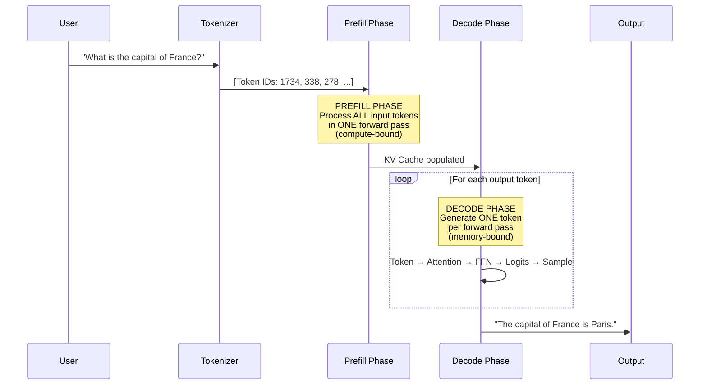
```mermaid
sequenceDiagram
    participant User
    participant Tokenizer
    participant Prefill as Prefill Phase
    participant Decode as Decode Phase
    participant Output

    User->>Tokenizer: "What is the capital of France?"
    Tokenizer->>Prefill: [Token IDs: 1734, 338, 278, ...]

    Note over Prefill: PREFILL PHASE<br/>Process ALL input tokens<br/>in ONE forward pass<br/>(compute-bound)

    Prefill->>Decode: KV Cache populated

    loop For each output token
        Note over Decode: DECODE PHASE<br/>Generate ONE token<br/>per forward pass<br/>(memory-bound)
        Decode->>Decode: Token → Attention → FFN → Logits → Sample
    end

    Decode->>Output: "The capital of France is Paris."
```

### What Happens Inside a Transformer Layer

Each layer of the model performs these operations:

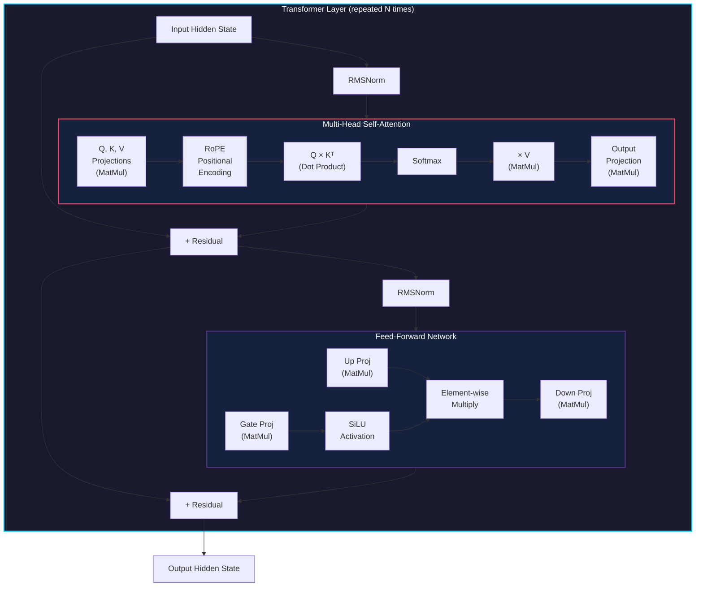
```mermaid
flowchart TB
    subgraph Layer["Transformer Layer (repeated N times)"]
        direction TB
        IN[Input Hidden State] --> NORM1[RMSNorm]
        NORM1 --> ATTN

        subgraph ATTN["Multi-Head Self-Attention"]
            direction LR
            QKV["Q, K, V\nProjections\n(MatMul)"] --> ROPE["RoPE\nPositional\nEncoding"]
            ROPE --> DOT["Q × Kᵀ\n(Dot Product)"]
            DOT --> SOFT["Softmax"]
            SOFT --> VMUL["× V\n(MatMul)"]
            VMUL --> PROJ["Output\nProjection\n(MatMul)"]
        end

        ATTN --> ADD1["+  Residual"]
        IN --> ADD1

        ADD1 --> NORM2[RMSNorm]
        NORM2 --> FFN

        subgraph FFN["Feed-Forward Network"]
            direction LR
            GATE["Gate Proj\n(MatMul)"] --> SILU["SiLU\nActivation"]
            UP["Up Proj\n(MatMul)"] --> MUL["Element-wise\nMultiply"]
            SILU --> MUL
            MUL --> DOWN["Down Proj\n(MatMul)"]
        end

        FFN --> ADD2["+  Residual"]
        ADD1 --> ADD2
    end

    ADD2 --> OUT[Output Hidden State]

    style Layer fill:#1a1a2e,stroke:#00d4ff,stroke-width:2px,color:#fff
    style ATTN fill:#16213e,stroke:#e94560,stroke-width:2px,color:#fff
    style FFN fill:#16213e,stroke:#533483,stroke-width:2px,color:#fff
```

> [!IMPORTANT]
> **The key insight**: Almost every box labeled `MatMul` is a **matrix multiplication**. This single operation accounts for **~90% of compute time**. That's why optimizing matrix multiply is so impactful.

### Where Time Is Spent — The Cost Breakdown

| Operation | % of Time | Bottleneck Type | Optimization Target |
|-----------|-----------|-----------------|---------------------|
| Matrix Multiplications | ~80-90% | Compute + Memory BW | SIMD, tiling, quantization |
| Attention (QK^T, softmax) | ~5-10% | Memory bandwidth | KV cache optimization |
| Token Sampling | ~1-2% | Latency | Efficient top-k/top-p |
| Tokenization | <1% | CPU | Usually negligible |
| Memory Allocation | ~2-5% | System | Memory pooling |

---

## Project Architecture

### System Component Diagram

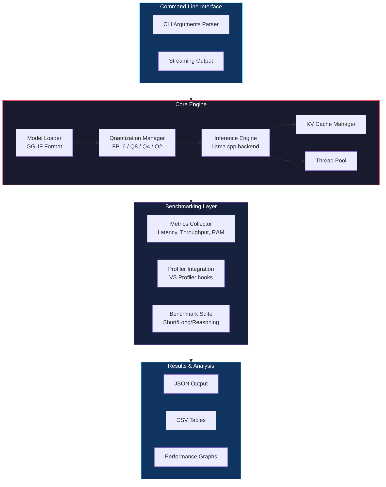
```mermaid
flowchart TB
    subgraph CLI["Command-Line Interface"]
        ARGS[CLI Arguments Parser]
        STREAM[Streaming Output]
    end

    subgraph CORE["Core Engine"]
        LOADER[Model Loader<br/>GGUF Format]
        QUANT[Quantization Manager<br/>FP16 / Q8 / Q4 / Q2]
        INFER[Inference Engine<br/>llama.cpp backend]
        KV[KV Cache Manager]
        THREAD[Thread Pool]
    end

    subgraph BENCH["Benchmarking Layer"]
        METRICS[Metrics Collector<br/>Latency, Throughput, RAM]
        PROFILER[Profiler Integration<br/>VS Profiler hooks]
        SUITE[Benchmark Suite<br/>Short/Long/Reasoning]
    end

    subgraph RESULTS["Results & Analysis"]
        JSON[JSON Output]
        CSV[CSV Tables]
        GRAPHS[Performance Graphs]
    end

    CLI --> CORE
    CORE --> BENCH
    BENCH --> RESULTS
    LOADER --> QUANT
    QUANT --> INFER
    INFER --> KV
    INFER --> THREAD

    style CLI fill:#0f3460,stroke:#00d4ff,color:#fff
    style CORE fill:#1a1a2e,stroke:#e94560,stroke-width:2px,color:#fff
    style BENCH fill:#16213e,stroke:#533483,color:#fff
    style RESULTS fill:#0f3460,stroke:#00d4ff,color:#fff
```

### Directory Structure

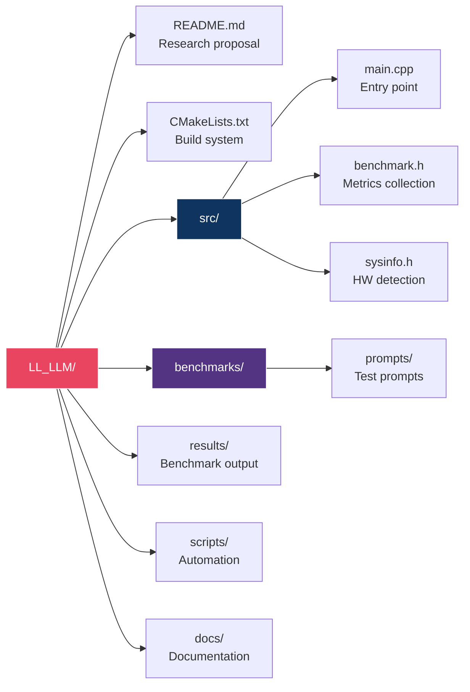
```mermaid
flowchart LR
    ROOT["LL_LLM/"]
    README["README.md\nResearch proposal"]
    CMAKE["CMakeLists.txt\nBuild system"]

    SRC["src/"]
    MAIN["main.cpp\nEntry point"]
    BENCH_CPP["benchmark.h\nMetrics collection"]
    SYSINFO["sysinfo.h\nHW detection"]

    BENCHDIR["benchmarks/"]
    PROMPTS["prompts/\nTest prompts"]

    RESULTS_DIR["results/\nBenchmark output"]
    SCRIPTS["scripts/\nAutomation"]
    DOCS["docs/\nDocumentation"]

    ROOT --> README
    ROOT --> CMAKE
    ROOT --> SRC
    ROOT --> BENCHDIR
    ROOT --> RESULTS_DIR
    ROOT --> SCRIPTS
    ROOT --> DOCS
    SRC --> MAIN
    SRC --> BENCH_CPP
    SRC --> SYSINFO
    BENCHDIR --> PROMPTS

    style ROOT fill:#e94560,stroke:#fff,color:#fff
    style SRC fill:#0f3460,stroke:#fff,color:#fff
    style BENCHDIR fill:#533483,stroke:#fff,color:#fff
```

---

## Phase 0 — Objective & Metrics

### Target Definition

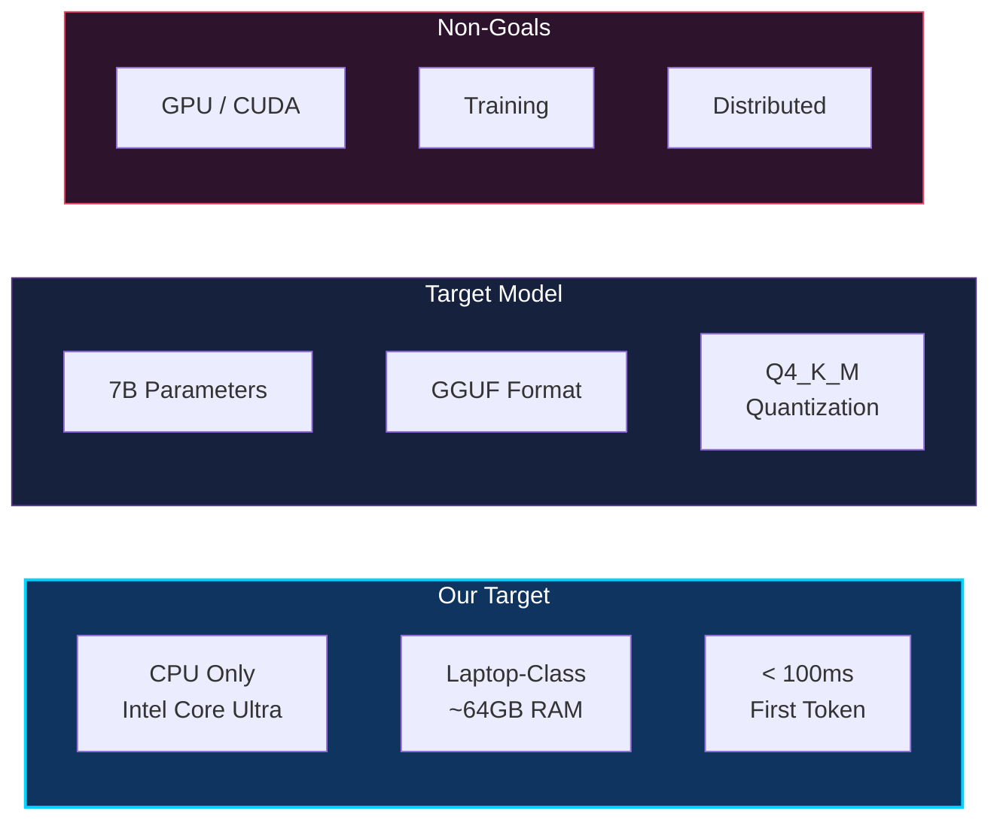
```mermaid
flowchart LR
    subgraph Target["Our Target"]
        CPU["CPU Only<br/>Intel Core Ultra"]
        LAPTOP["Laptop-Class<br/>~64GB RAM"]
        LATENCY["< 100ms<br/>First Token"]
    end

    subgraph Model["Target Model"]
        SIZE["7B Parameters"]
        FORMAT["GGUF Format"]
        QUANT_T["Q4_K_M<br/>Quantization"]
    end

    subgraph NonGoals["Non-Goals"]
        GPU_NG["GPU / CUDA"]
        TRAIN["Training"]
        DIST["Distributed"]
    end

    style Target fill:#0f3460,stroke:#00d4ff,stroke-width:2px,color:#fff
    style Model fill:#16213e,stroke:#533483,color:#fff
    style NonGoals fill:#2d142c,stroke:#e94560,color:#fff
```

### Metrics We Will Track

| Metric | Unit | How Measured | Why It Matters |
|--------|------|--------------|----------------|
| **First Token Latency** | ms | Time from prompt submit to first output token | User-perceived responsiveness |
| **Tokens/Second** | tok/s | Total tokens ÷ generation time | Raw throughput |
| **Peak RAM Usage** | MB | Windows `GetProcessMemoryInfo()` | Memory footprint on constrained devices |
| **Model Load Time** | ms | Time to load GGUF from disk to RAM | Cold start performance |
| **Accuracy (Perplexity)** | score | Comparison against FP16 baseline | Ensure quantization doesn't destroy quality |

---

## Phase 1 — Baseline System

### How llama.cpp Works

llama.cpp is a pure C/C++ inference engine for LLMs. Here's how our harness interacts with it:

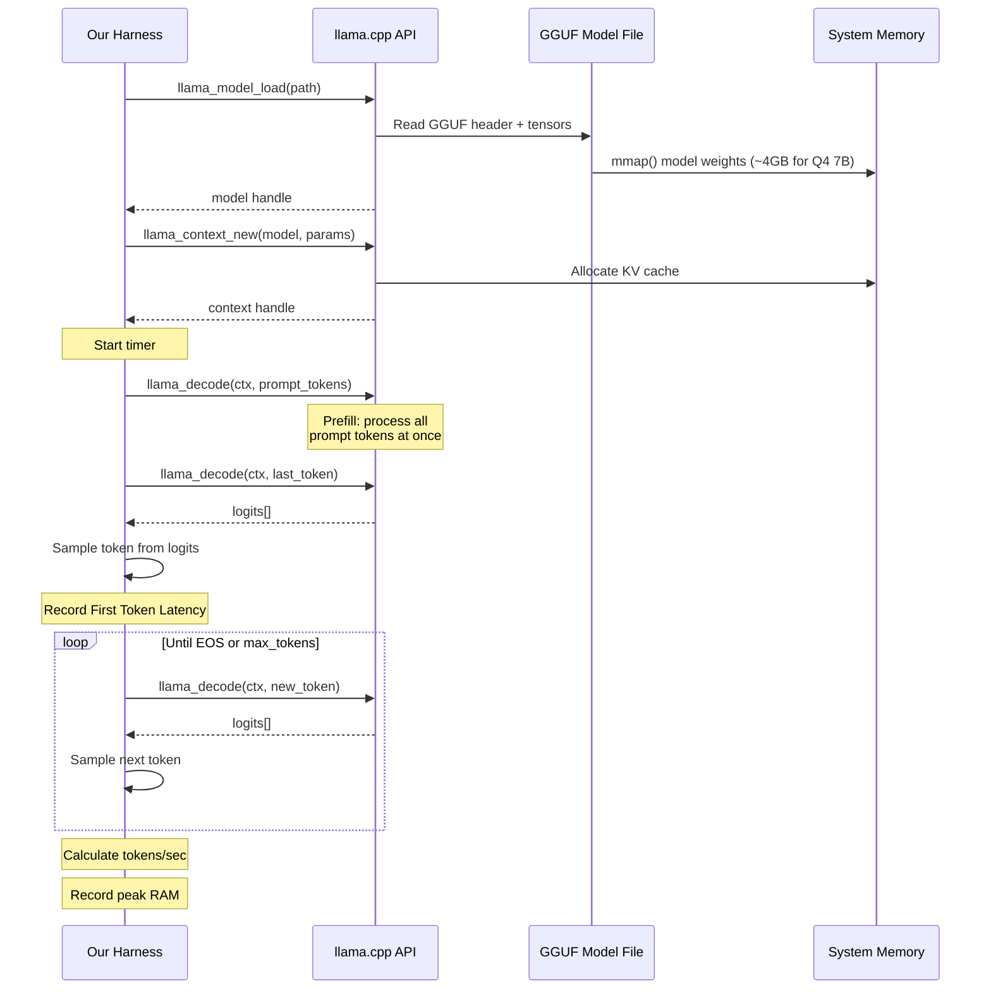
```mermaid
sequenceDiagram
    participant CLI as Our Harness
    participant LLAMA as llama.cpp API
    participant MODEL as GGUF Model File
    participant MEM as System Memory

    CLI->>LLAMA: llama_model_load(path)
    LLAMA->>MODEL: Read GGUF header + tensors
    MODEL->>MEM: mmap() model weights (~4GB for Q4 7B)
    LLAMA-->>CLI: model handle

    CLI->>LLAMA: llama_context_new(model, params)
    LLAMA->>MEM: Allocate KV cache
    LLAMA-->>CLI: context handle

    Note over CLI: Start timer

    CLI->>LLAMA: llama_decode(ctx, prompt_tokens)
    Note over LLAMA: Prefill: process all<br/>prompt tokens at once

    CLI->>LLAMA: llama_decode(ctx, last_token)
    LLAMA-->>CLI: logits[]
    CLI->>CLI: Sample token from logits

    Note over CLI: Record First Token Latency

    loop Until EOS or max_tokens
        CLI->>LLAMA: llama_decode(ctx, new_token)
        LLAMA-->>CLI: logits[]
        CLI->>CLI: Sample next token
    end

    Note over CLI: Calculate tokens/sec
    Note over CLI: Record peak RAM
```

### What We Measure in Baseline

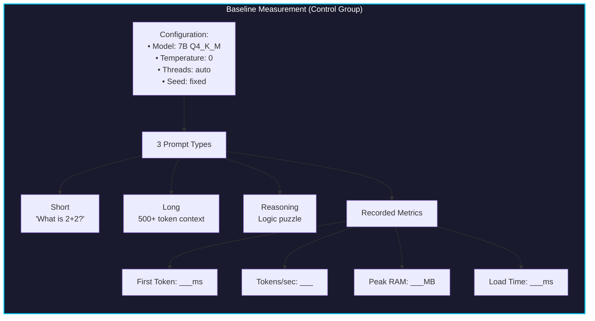
```mermaid
flowchart TB
    subgraph Baseline["Baseline Measurement (Control Group)"]
        direction TB
        CONFIG["Configuration:<br/>• Model: 7B Q4_K_M<br/>• Temperature: 0<br/>• Threads: auto<br/>• Seed: fixed"]

        PROMPTS["3 Prompt Types"]
        SHORT["Short\n'What is 2+2?'"]
        LONG["Long\n500+ token context"]
        REASON["Reasoning\nLogic puzzle"]

        PROMPTS --> SHORT
        PROMPTS --> LONG
        PROMPTS --> REASON

        RECORD["Recorded Metrics"]
        M1["First Token: ___ms"]
        M2["Tokens/sec: ___"]
        M3["Peak RAM: ___MB"]
        M4["Load Time: ___ms"]

        RECORD --> M1
        RECORD --> M2
        RECORD --> M3
        RECORD --> M4
    end

    CONFIG --> PROMPTS
    PROMPTS --> RECORD

    style Baseline fill:#1a1a2e,stroke:#00d4ff,stroke-width:2px,color:#fff
```

---

## Phase 2 — Profiling & Bottleneck Analysis

### Profiling Strategy

We use the **Visual Studio Performance Profiler** to identify where time is spent. We do NOT guess — we **measure**.

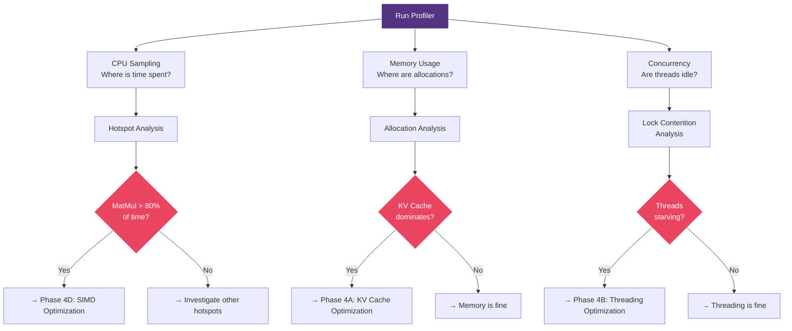
```mermaid
flowchart TB
    PROFILE["Run Profiler"]
    CPU_PROF["CPU Sampling<br/>Where is time spent?"]
    MEM_PROF["Memory Usage<br/>Where are allocations?"]
    THREAD_PROF["Concurrency<br/>Are threads idle?"]

    PROFILE --> CPU_PROF
    PROFILE --> MEM_PROF
    PROFILE --> THREAD_PROF

    CPU_PROF --> HOTSPOT["Hotspot Analysis"]
    MEM_PROF --> ALLOC["Allocation Analysis"]
    THREAD_PROF --> CONTENTION["Lock Contention<br/>Analysis"]

    HOTSPOT --> Q1{"MatMul > 80%\nof time?"}
    ALLOC --> Q2{"KV Cache\ndominates?"}
    CONTENTION --> Q3{"Threads\nstarving?"}

    Q1 -->|Yes| OPT1["→ Phase 4D: SIMD Optimization"]
    Q1 -->|No| OPT1B["→ Investigate other hotspots"]
    Q2 -->|Yes| OPT2["→ Phase 4A: KV Cache Optimization"]
    Q2 -->|No| OPT2B["→ Memory is fine"]
    Q3 -->|Yes| OPT3["→ Phase 4B: Threading Optimization"]
    Q3 -->|No| OPT3B["→ Threading is fine"]

    style PROFILE fill:#533483,stroke:#fff,color:#fff
    style Q1 fill:#e94560,stroke:#fff,color:#fff
    style Q2 fill:#e94560,stroke:#fff,color:#fff
    style Q3 fill:#e94560,stroke:#fff,color:#fff
```

### What the Profiler Reveals (Expected)

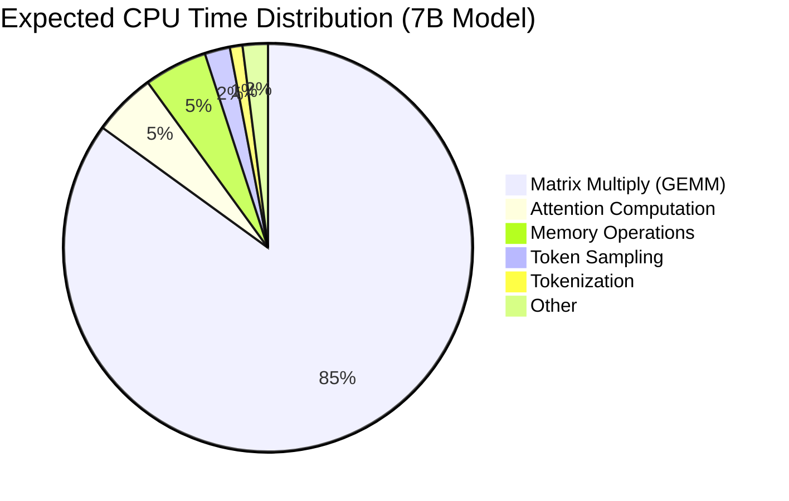
```mermaid
pie title Expected CPU Time Distribution (7B Model)
    "Matrix Multiply (GEMM)" : 85
    "Attention Computation" : 5
    "Memory Operations" : 5
    "Token Sampling" : 2
    "Tokenization" : 1
    "Other" : 2
```

---

## Phase 3 — Quantization Study

### What Is Quantization?

Quantization reduces the **precision** of model weights from 16-bit floats to fewer bits. Less precision = less memory + faster compute, but potentially less accuracy.

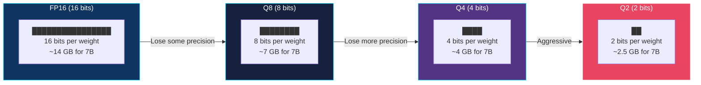
```mermaid
flowchart LR
    subgraph FP16["FP16 (16 bits)"]
        direction TB
        FP16_BITS["████████████████<br/>16 bits per weight<br/>~14 GB for 7B"]
    end

    subgraph Q8["Q8 (8 bits)"]
        direction TB
        Q8_BITS["████████<br/>8 bits per weight<br/>~7 GB for 7B"]
    end

    subgraph Q4["Q4 (4 bits)"]
        direction TB
        Q4_BITS["████<br/>4 bits per weight<br/>~4 GB for 7B"]
    end

    subgraph Q2["Q2 (2 bits)"]
        direction TB
        Q2_BITS["██<br/>2 bits per weight<br/>~2.5 GB for 7B"]
    end

    FP16 -->|"Lose some precision"| Q8
    Q8 -->|"Lose more precision"| Q4
    Q4 -->|"Aggressive"| Q2

    style FP16 fill:#0f3460,stroke:#00d4ff,color:#fff
    style Q8 fill:#16213e,stroke:#00d4ff,color:#fff
    style Q4 fill:#533483,stroke:#00d4ff,color:#fff
    style Q2 fill:#e94560,stroke:#fff,color:#fff
```

### Quantization Comparison Table (Template)

This is what we'll fill in during Phase 3:

| Format | Bits | Model Size | First Token (ms) | Tokens/sec | Peak RAM (MB) | Accuracy Score |
|--------|------|------------|-------------------|------------|---------------|----------------|
| FP16 | 16 | ~14 GB | baseline | baseline | baseline | 100% |
| Q8_0 | 8 | ~7 GB | ? | ? | ? | ~99% |
| Q4_K_M | 4 | ~4 GB | ? | ? | ? | ~95-97% |
| Q2_K | 2 | ~2.5 GB | ? | ? | ? | ~85-90% |

### Accuracy Testing Methodology

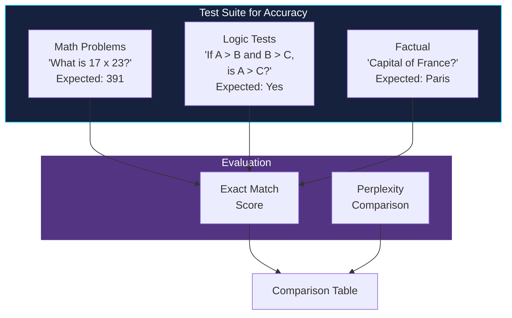
```mermaid
flowchart TB
    subgraph TestSuite["Test Suite for Accuracy"]
        MATH["Math Problems<br/>'What is 17 x 23?'<br/>Expected: 391"]
        LOGIC["Logic Tests<br/>'If A > B and B > C,<br/>is A > C?'<br/>Expected: Yes"]
        FACT["Factual<br/>'Capital of France?'<br/>Expected: Paris"]
    end

    subgraph Eval["Evaluation"]
        EXACT["Exact Match<br/>Score"]
        PERP["Perplexity<br/>Comparison"]
    end

    MATH --> EXACT
    LOGIC --> EXACT
    FACT --> EXACT
    EXACT --> TABLE["Comparison Table"]
    PERP --> TABLE

    style TestSuite fill:#16213e,stroke:#00d4ff,color:#fff
    style Eval fill:#533483,stroke:#fff,color:#fff
```

---

## Phase 4 — Advanced Optimizations

This is where the real systems engineering happens. Based on Phase 2 profiling results, we pick 2-3 of these:

### 4A — KV Cache Optimization

The KV cache stores the Key and Value matrices from previous tokens so they don't need to be recomputed. It **grows linearly with sequence length** and becomes a memory bottleneck.

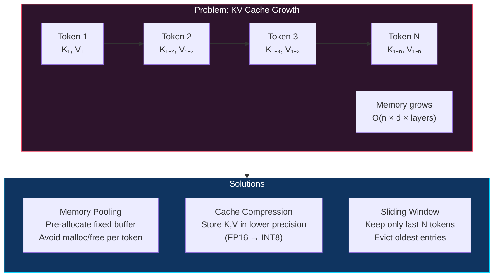
```mermaid
flowchart TB
    subgraph Problem["Problem: KV Cache Growth"]
        direction LR
        T1["Token 1<br/>K₁, V₁"] --> T2["Token 2<br/>K₁₋₂, V₁₋₂"] --> T3["Token 3<br/>K₁₋₃, V₁₋₃"] --> TN["Token N<br/>K₁₋ₙ, V₁₋ₙ"]
        MEM["Memory grows<br/>O(n × d × layers)"]
    end

    subgraph Solutions["Solutions"]
        direction TB
        POOL["Memory Pooling<br/>Pre-allocate fixed buffer<br/>Avoid malloc/free per token"]
        COMPRESS["Cache Compression<br/>Store K,V in lower precision<br/>(FP16 → INT8)"]
        EVICT["Sliding Window<br/>Keep only last N tokens<br/>Evict oldest entries"]
    end

    Problem --> Solutions

    style Problem fill:#2d142c,stroke:#e94560,color:#fff
    style Solutions fill:#0f3460,stroke:#00d4ff,color:#fff
```

### 4B — Threading Optimization

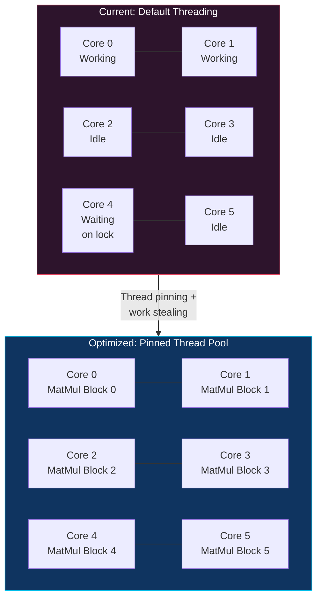
```mermaid
flowchart TB
    subgraph Current["Current: Default Threading"]
        direction LR
        C0["Core 0<br/>Working"] --- C1["Core 1<br/>Working"]
        C2["Core 2<br/>Idle"] --- C3["Core 3<br/>Idle"]
        C4["Core 4<br/>Waiting<br/>on lock"] --- C5["Core 5<br/>Idle"]
    end

    subgraph Optimized["Optimized: Pinned Thread Pool"]
        direction LR
        O0["Core 0<br/>MatMul Block 0"] --- O1["Core 1<br/>MatMul Block 1"]
        O2["Core 2<br/>MatMul Block 2"] --- O3["Core 3<br/>MatMul Block 3"]
        O4["Core 4<br/>MatMul Block 4"] --- O5["Core 5<br/>MatMul Block 5"]
    end

    Current -->|"Thread pinning +<br/>work stealing"| Optimized

    style Current fill:#2d142c,stroke:#e94560,color:#fff
    style Optimized fill:#0f3460,stroke:#00d4ff,color:#fff
```

### Thread Scaling Test Plan

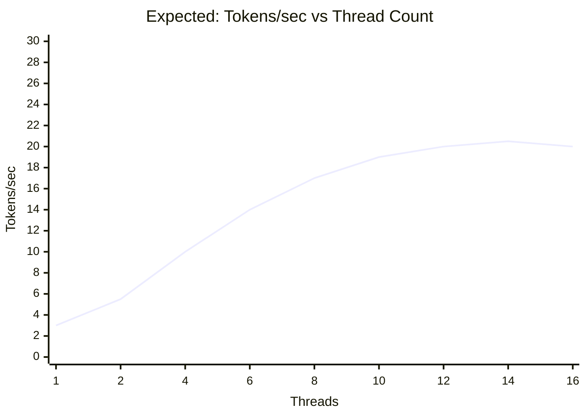
```mermaid
xychart-beta
    title "Expected: Tokens/sec vs Thread Count"
    x-axis "Threads" [1, 2, 4, 6, 8, 10, 12, 14, 16]
    y-axis "Tokens/sec" 0 --> 30
    line "Expected Curve" [3, 5.5, 10, 14, 17, 19, 20, 20.5, 20]
```

> [!NOTE]
> Performance typically **plateaus** after saturating memory bandwidth. More threads ≠ more speed past a certain point. Finding that inflection point is the goal.

### 4C — Speculative Decoding

This is the most **research-grade** optimization. Use a small, fast "draft" model to predict multiple tokens, then verify them in bulk with the large model.

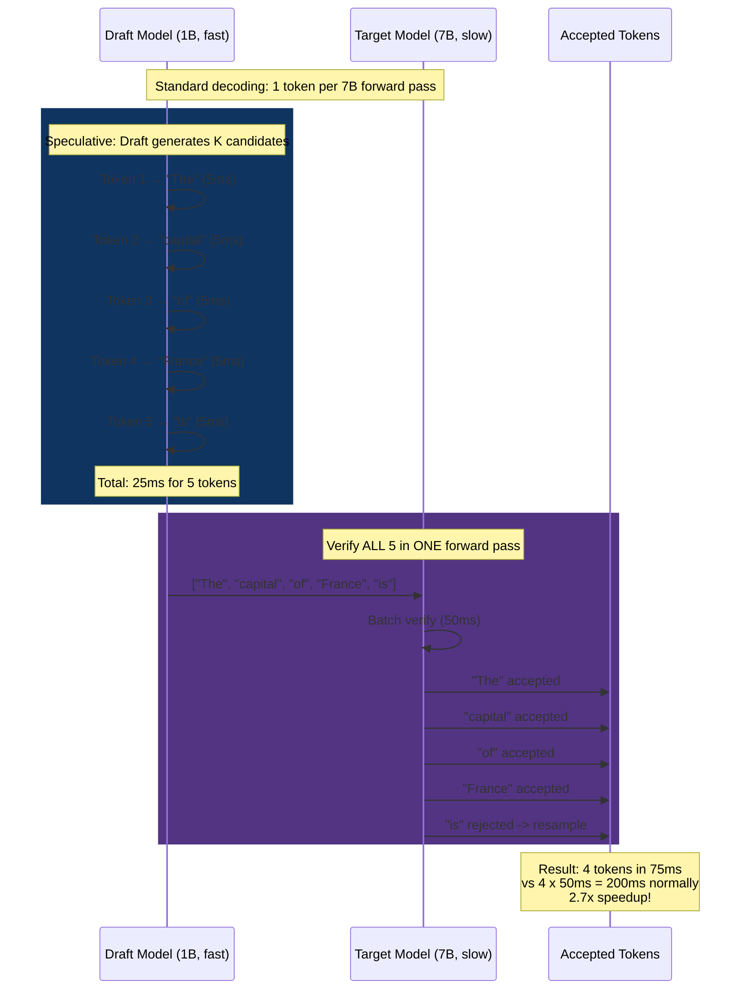
```mermaid
sequenceDiagram
    participant Draft as Draft Model (1B, fast)
    participant Target as Target Model (7B, slow)
    participant Output as Accepted Tokens

    Note over Draft,Target: Standard decoding: 1 token per 7B forward pass

    rect rgb(15, 52, 96)
        Note over Draft: Speculative: Draft generates K candidates
        Draft->>Draft: Token 1 → "The" (5ms)
        Draft->>Draft: Token 2 → "capital" (5ms)
        Draft->>Draft: Token 3 → "of" (5ms)
        Draft->>Draft: Token 4 → "France" (5ms)
        Draft->>Draft: Token 5 → "is" (5ms)
        Note over Draft: Total: 25ms for 5 tokens
    end

    rect rgb(83, 52, 131)
        Note over Target: Verify ALL 5 in ONE forward pass
        Draft->>Target: ["The", "capital", "of", "France", "is"]
        Target->>Target: Batch verify (50ms)
        Target->>Output: "The" accepted
        Target->>Output: "capital" accepted
        Target->>Output: "of" accepted
        Target->>Output: "France" accepted
        Target->>Output: "is" rejected -> resample
    end

    Note over Output: Result: 4 tokens in 75ms<br/>vs 4 x 50ms = 200ms normally<br/>2.7x speedup!
```

### 4D — SIMD Matrix Multiplication

SIMD (Single Instruction, Multiple Data) processes multiple values per CPU instruction:

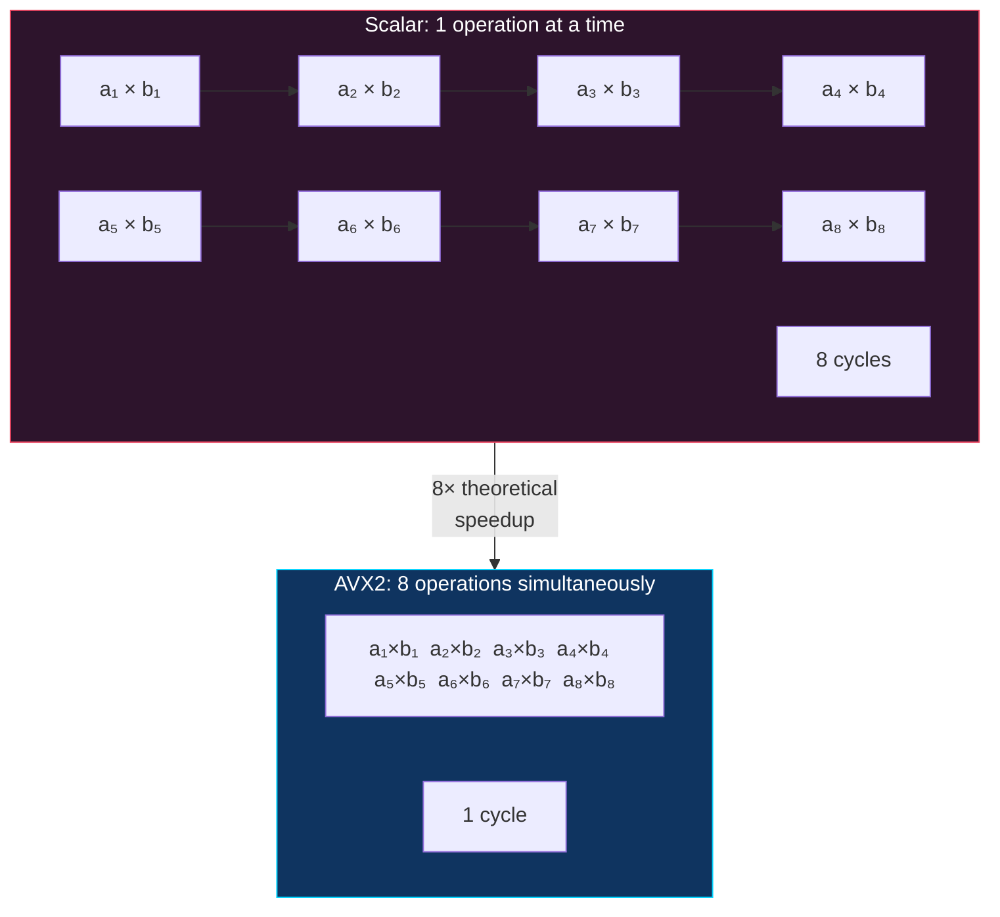
```mermaid
flowchart TB
    subgraph Scalar["Scalar: 1 operation at a time"]
        direction LR
        S1["a₁ × b₁"] --> S2["a₂ × b₂"] --> S3["a₃ × b₃"] --> S4["a₄ × b₄"]
        S5["a₅ × b₅"] --> S6["a₆ × b₆"] --> S7["a₇ × b₇"] --> S8["a₈ × b₈"]
        ST["8 cycles"]
    end

    subgraph AVX2["AVX2: 8 operations simultaneously"]
        direction LR
        V1["a₁×b₁  a₂×b₂  a₃×b₃  a₄×b₄  a₅×b₅  a₆×b₆  a₇×b₇  a₈×b₈"]
        VT["1 cycle"]
    end

    Scalar -->|"8× theoretical<br/>speedup"| AVX2

    style Scalar fill:#2d142c,stroke:#e94560,color:#fff
    style AVX2 fill:#0f3460,stroke:#00d4ff,color:#fff
```

### Cache-Aware Tiling for Matrix Multiply

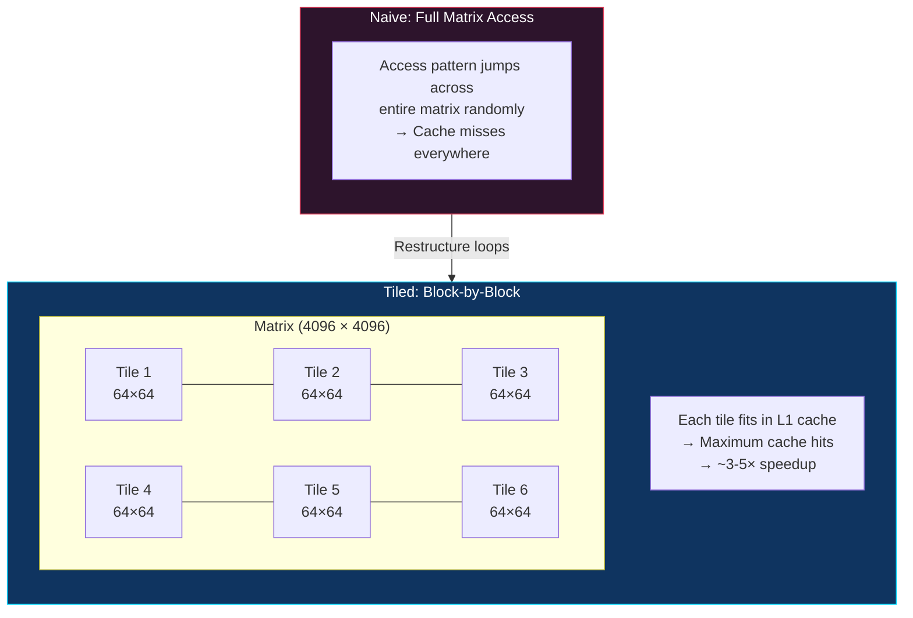
```mermaid
flowchart TB
    subgraph Naive["Naive: Full Matrix Access"]
        direction TB
        NM["Access pattern jumps across<br/>entire matrix randomly<br/>→ Cache misses everywhere"]
    end

    subgraph Tiled["Tiled: Block-by-Block"]
        direction TB
        subgraph Matrix["Matrix (4096 × 4096)"]
            T1["Tile 1<br/>64×64"] --- T2["Tile 2<br/>64×64"] --- T3["Tile 3<br/>64×64"]
            T4["Tile 4<br/>64×64"] --- T5["Tile 5<br/>64×64"] --- T6["Tile 6<br/>64×64"]
        end
        TM["Each tile fits in L1 cache<br/>→ Maximum cache hits<br/>→ ~3-5× speedup"]
    end

    Naive -->|"Restructure loops"| Tiled

    style Naive fill:#2d142c,stroke:#e94560,color:#fff
    style Tiled fill:#0f3460,stroke:#00d4ff,color:#fff
```

---

## Phase 5 — Evaluation Framework

### Benchmark Architecture

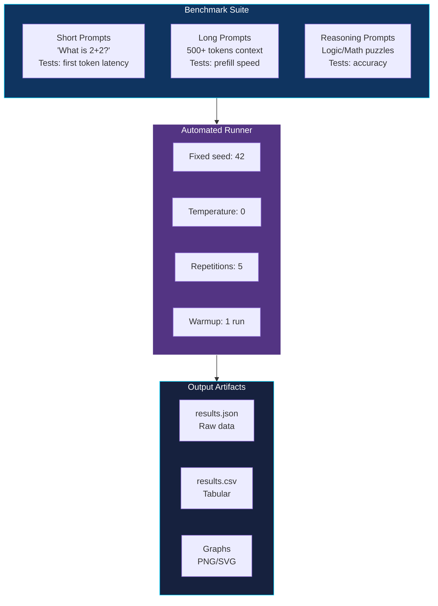
```mermaid
flowchart TB
    subgraph Suite["Benchmark Suite"]
        direction TB
        SP["Short Prompts<br/>'What is 2+2?'<br/>Tests: first token latency"]
        LP["Long Prompts<br/>500+ tokens context<br/>Tests: prefill speed"]
        RP["Reasoning Prompts<br/>Logic/Math puzzles<br/>Tests: accuracy"]
    end

    subgraph Runner["Automated Runner"]
        SEED["Fixed seed: 42"]
        TEMP["Temperature: 0"]
        REPS["Repetitions: 5"]
        WARMUP["Warmup: 1 run"]
    end

    subgraph Output["Output Artifacts"]
        JSON_OUT["results.json<br/>Raw data"]
        CSV_OUT["results.csv<br/>Tabular"]
        GRAPHS_OUT["Graphs<br/>PNG/SVG"]
    end

    Suite --> Runner --> Output

    style Suite fill:#0f3460,stroke:#00d4ff,color:#fff
    style Runner fill:#533483,stroke:#fff,color:#fff
    style Output fill:#16213e,stroke:#00d4ff,color:#fff
```

### Graphs We Will Generate

```mermaid
flowchart LR
    subgraph G1["Graph 1"]
        G1T["Latency vs<br/>Quantization"]
    end
    subgraph G2["Graph 2"]
        G2T["Accuracy vs<br/>Quantization"]
    end
    subgraph G3["Graph 3"]
        G3T["Throughput vs<br/>Thread Count"]
    end
    subgraph G4["Graph 4"]
        G4T["Latency vs<br/>Model Size"]
    end

    style G1 fill:#e94560,stroke:#fff,color:#fff
    style G2 fill:#0f3460,stroke:#fff,color:#fff
    style G3 fill:#533483,stroke:#fff,color:#fff
    style G4 fill:#16213e,stroke:#00d4ff,color:#fff
```

---

## Phase 6 — Portfolio Features

Pick one of these to make the project **production-impressive**:

### Option A: Real-Time Streaming CLI

```mermaid
sequenceDiagram
    participant User
    participant CLI as CLI Application
    participant Engine as Inference Engine

    User->>CLI: Type prompt + Enter

    Note over CLI: Target: <100ms to first token

    CLI->>Engine: Start inference
    Engine-->>CLI: Token "The" (85ms)
    CLI->>User: The▌

    Engine-->>CLI: Token " capital" (25ms)
    CLI->>User: The capital▌

    Engine-->>CLI: Token " of" (24ms)
    CLI->>User: The capital of▌

    Engine-->>CLI: Token " France" (26ms)
    CLI->>User: The capital of France▌

    Engine-->>CLI: [EOS]
    CLI->>User: The capital of France is Paris.

    Note over User: Total: ~200ms for 7 tokens<br/>Feels instant!
```

### Option B: Adaptive Quantization Engine

```mermaid
flowchart TB
    DETECT["Detect Current State"]
    PROMPT_LEN{"Prompt\nLength?"}
    CPU_LOAD{"CPU\nLoad?"}
    RAM_FREE{"Free\nRAM?"}

    DETECT --> PROMPT_LEN
    DETECT --> CPU_LOAD
    DETECT --> RAM_FREE

    PROMPT_LEN -->|Short| Q4_MODE["Use Q4_K_M<br/>Best speed"]
    PROMPT_LEN -->|Long| Q8_MODE["Use Q8_0<br/>Better accuracy"]

    CPU_LOAD -->|High| THROTTLE["Reduce threads"]
    CPU_LOAD -->|Low| BOOST["Max threads"]

    RAM_FREE -->|< 4GB| Q4_FORCE["Force Q4"]
    RAM_FREE -->|> 8GB| Q8_OK["Allow Q8"]

    style DETECT fill:#533483,stroke:#fff,color:#fff
    style PROMPT_LEN fill:#e94560,stroke:#fff,color:#fff
    style CPU_LOAD fill:#e94560,stroke:#fff,color:#fff
    style RAM_FREE fill:#e94560,stroke:#fff,color:#fff
```

### Option C: Auto-Tuning Engine

```mermaid
flowchart TB
    subgraph Detection["Hardware Detection"]
        CORES["CPU Cores: ?"]
        CACHE["L1/L2/L3 Cache: ?"]
        RAM_DET["Total RAM: ?"]
        SIMD_DET["SIMD Support: ?"]
    end

    subgraph Tuning["Auto-Configuration"]
        THREADS_SET["Thread Count =<br/>f(cores, cache)"]
        BATCH_SET["Batch Size =<br/>f(RAM, model)"]
        TILE_SET["Tile Size =<br/>f(L1 cache)"]
        QUANT_SET["Quantization =<br/>f(RAM, accuracy)"]
    end

    subgraph Output_Config["Optimal Config"]
        CONF["threads: 8<br/>batch: 512<br/>tile: 64<br/>quant: Q4_K_M"]
    end

    Detection --> Tuning --> Output_Config

    style Detection fill:#0f3460,stroke:#00d4ff,color:#fff
    style Tuning fill:#533483,stroke:#fff,color:#fff
    style Output_Config fill:#16213e,stroke:#00d4ff,color:#fff
```

---

## Timeline & Milestones

```mermaid
gantt
    title LL_LLM Project Timeline
    dateFormat YYYY-MM-DD
    axisFormat %b %d

    section Phase 0
    Define Objective & Setup     :p0, 2026-02-11, 2d

    section Phase 1
    Build llama.cpp              :p1a, after p0, 2d
    Run Baseline Benchmarks      :p1b, after p1a, 3d

    section Phase 2
    VS Profiler Setup            :p2a, after p1b, 1d
    Profile & Analyze            :p2b, after p2a, 4d
    Document Findings            :p2c, after p2b, 2d

    section Phase 3
    Quantization Experiments     :p3a, after p2c, 3d
    Accuracy Testing             :p3b, after p3a, 2d
    Comparison Table & Graphs    :p3c, after p3b, 2d

    section Phase 4
    KV Cache Optimization        :p4a, after p3c, 4d
    Threading Optimization       :p4b, after p4a, 4d
    Speculative Decoding         :p4c, after p4b, 5d

    section Phase 5
    Benchmark Suite              :p5a, after p4c, 3d
    Automated Testing            :p5b, after p5a, 2d
    Generate Graphs              :p5c, after p5b, 2d

    section Phase 6
    Portfolio Feature             :p6, after p5c, 5d
```

---

> [!TIP]
> **Start small, measure everything.** The most impressive optimization isn't the fanciest code — it's the one backed by profiler data showing a 3× speedup with a before/after comparison chart.
